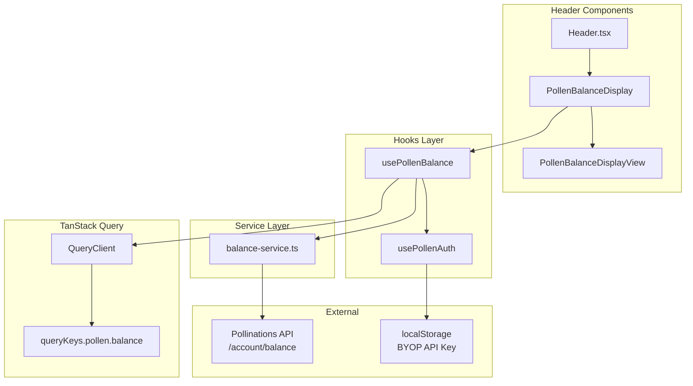
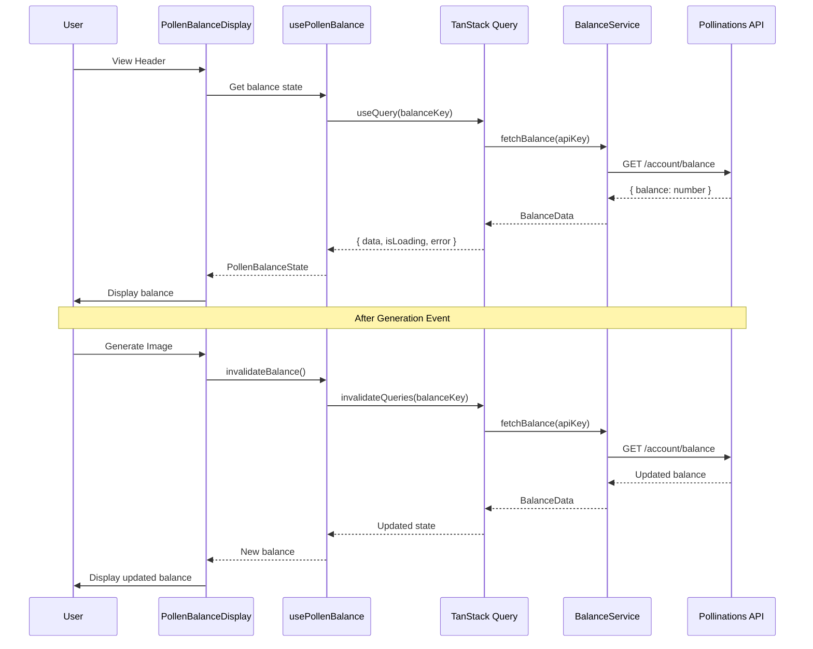

# Design Document: Pollen Balance Display

## Overview

This design implements a Pollen Balance Display component that shows the user's current Pollinations account balance in the application header. The component fetches balance data directly from the Pollinations API using the user's BYOP (Bring Your Own Pollen) API key stored in localStorage, avoiding any Convex database synchronization.

The architecture leverages TanStack Query for data fetching with intelligent caching, automatic refetching after generation events, and debouncing to prevent API rate limiting. The component follows the existing codebase patterns: container/view component separation, custom hooks for logic, and consistent styling with other header elements.

## Architecture



### Data Flow



## Components and Interfaces

### Component Structure

```
components/
├── pollen-balance/
│   ├── index.ts                      # Barrel export
│   ├── pollen-balance-display.tsx    # Container component
│   └── pollen-balance-display-view.tsx # Presentational component

hooks/
├── use-pollen-balance.ts             # Balance fetching hook
├── use-pollen-balance.test.ts        # Hook tests

lib/
├── pollen-auth/
│   └── balance-service.ts            # API service for balance
├── query/
│   └── query-keys.ts                 # Add pollen balance keys
```

### Interfaces

```typescript
// lib/pollen-auth/balance-service.ts

/**
 * Response from Pollinations /account/balance endpoint
 */
export interface PollenBalanceResponse {
  /** The remaining pollen balance */
  balance: number
}

/**
 * Error types from balance API
 */
export type BalanceErrorCode = 
  | "UNAUTHORIZED"      // 401 - Invalid or missing API key
  | "FORBIDDEN"         // 403 - Missing account:balance permission
  | "NETWORK_ERROR"     // Network failure
  | "UNKNOWN_ERROR"     // Unexpected error

export interface BalanceError {
  code: BalanceErrorCode
  message: string
}

/**
 * Fetches the user's pollen balance from Pollinations API
 */
export async function fetchPollenBalance(apiKey: string): Promise<PollenBalanceResponse>
```

```typescript
// hooks/use-pollen-balance.ts

export interface UsePollenBalanceReturn {
  /** Current balance value (null if not loaded) */
  balance: number | null
  /** Formatted balance string for display */
  formattedBalance: string | null
  /** Whether balance is currently being fetched */
  isLoading: boolean
  /** Whether there was an error fetching balance */
  isError: boolean
  /** Error details if fetch failed */
  error: BalanceError | null
  /** Whether balance is considered low (below threshold) */
  isLowBalance: boolean
  /** Manually trigger a balance refresh */
  refetch: () => void
  /** Invalidate and refetch balance (for post-generation) */
  invalidateBalance: () => void
}

export function usePollenBalance(): UsePollenBalanceReturn
```

```typescript
// components/pollen-balance/pollen-balance-display-view.tsx

export interface PollenBalanceDisplayViewProps {
  /** Formatted balance string */
  formattedBalance: string | null
  /** Loading state */
  isLoading: boolean
  /** Error state */
  isError: boolean
  /** Low balance warning */
  isLowBalance: boolean
  /** Refresh handler */
  onRefresh: () => void
  /** Whether refresh is in progress */
  isRefreshing: boolean
}
```

## Data Models

### Query Key Structure

```typescript
// lib/query/query-keys.ts (additions)

export const queryKeys = {
  // ... existing keys
  
  /**
   * Pollen account queries
   */
  pollen: {
    /** Base key for all pollen queries */
    all: ["pollen"] as const,
    
    /** Balance query */
    balance: () => [...queryKeys.pollen.all, "balance"] as const,
    
    /** Profile query (future) */
    profile: () => [...queryKeys.pollen.all, "profile"] as const,
    
    /** Usage query (future) */
    usage: (params?: { limit?: number; before?: string }) =>
      [...queryKeys.pollen.all, "usage", params] as const,
  },
} as const
```

### Balance Service Implementation

```typescript
// lib/pollen-auth/balance-service.ts

const POLLINATIONS_API_BASE = "https://gen.pollinations.ai"

export async function fetchPollenBalance(apiKey: string): Promise<PollenBalanceResponse> {
  const response = await fetch(`${POLLINATIONS_API_BASE}/account/balance`, {
    method: "GET",
    headers: {
      "Authorization": `Bearer ${apiKey}`,
    },
  })

  if (!response.ok) {
    if (response.status === 401) {
      throw { code: "UNAUTHORIZED", message: "Invalid or expired API key" }
    }
    if (response.status === 403) {
      throw { code: "FORBIDDEN", message: "API key missing account:balance permission" }
    }
    throw { code: "UNKNOWN_ERROR", message: `HTTP ${response.status}` }
  }

  return response.json()
}
```

### Hook Implementation Pattern

```typescript
// hooks/use-pollen-balance.ts

export function usePollenBalance(): UsePollenBalanceReturn {
  const { apiKey, isAuthorized, isLoading: authLoading } = usePollenAuth()
  const queryClient = useQueryClient()

  const {
    data,
    isLoading: queryLoading,
    isError,
    error,
    refetch,
    isFetching,
  } = useQuery({
    queryKey: queryKeys.pollen.balance(),
    queryFn: () => fetchPollenBalance(apiKey!),
    enabled: isAuthorized && !!apiKey,
    staleTime: STALE_TIMES.DYNAMIC, // 5 minutes
    gcTime: GC_TIMES.SHORT, // 5 minutes
    refetchOnWindowFocus: true, // Refetch when user returns to tab
    retry: (failureCount, error) => {
      // Don't retry auth errors - requires user action
      if (error?.code === "UNAUTHORIZED" || error?.code === "FORBIDDEN") {
        return false
      }
      // Retry forever for retryable errors (network, unknown)
      return true
    },
    retryDelay: (attemptIndex) => {
      // Exponential backoff: 1s → 2s → 4s → 8s → 16s → 32s → 60s (capped)
      const delay = Math.min(1000 * Math.pow(2, attemptIndex), 60000)
      return delay
    },
  })

  const invalidateBalance = useCallback(() => {
    queryClient.invalidateQueries({ queryKey: queryKeys.pollen.balance() })
  }, [queryClient])

  // ... rest of implementation
}
```

## Correctness Properties

*A property is a characteristic or behavior that should hold true across all valid executions of a system—essentially, a formal statement about what the system should do. Properties serve as the bridge between human-readable specifications and machine-verifiable correctness guarantees.*

### Property 1: API Request Construction

*For any* valid BYOP API key, when `fetchPollenBalance` is called, the resulting HTTP request SHALL include the Authorization header with the format `Bearer {apiKey}` and target the correct endpoint URL.

**Validates: Requirements 2.1**

### Property 2: Response Parsing Round-Trip

*For any* valid balance number returned by the Pollinations API, parsing the response through `fetchPollenBalance` SHALL produce a `PollenBalanceResponse` object where `response.balance` equals the original balance value.

**Validates: Requirements 2.2**

### Property 3: Rate Limiting Behavior

*For any* sequence of `invalidateBalance` calls within a debounce window, the Balance_Service SHALL make at most one API request, and subsequent calls within the minimum refresh interval SHALL be coalesced.

**Validates: Requirements 3.3, 3.4**

### Property 4: Balance Formatting

*For any* numeric balance value, the `formatBalance` function SHALL produce a string representation with exactly 2 decimal places (e.g., `123.45`, `0.00`, `1000.00`).

**Validates: Requirements 4.1**

### Property 5: Low Balance Threshold Detection

*For any* balance value and configurable threshold, `isLowBalance` SHALL return `true` if and only if `balance < threshold`.

**Validates: Requirements 4.4**

## Error Handling

### Error Types and Recovery

| Error Code | HTTP Status | User Message | Recovery Action |
|------------|-------------|--------------|-----------------|
| `UNAUTHORIZED` | 401 | "API key invalid or expired" | Prompt to reconnect via PollenAuth |
| `FORBIDDEN` | 403 | "API key missing balance permission" | Show permission error, suggest new key |
| `NETWORK_ERROR` | N/A | "Unable to fetch balance" | Show retry button |
| `UNKNOWN_ERROR` | Other | "Something went wrong" | Show retry button |

### Error State Handling

```typescript
// Error handling in usePollenBalance
const getErrorMessage = (error: BalanceError | null): string => {
  if (!error) return ""
  
  switch (error.code) {
    case "UNAUTHORIZED":
      return "Your API key is invalid or expired. Please reconnect."
    case "FORBIDDEN":
      return "Your API key doesn't have balance permission."
    case "NETWORK_ERROR":
      return "Unable to fetch balance. Check your connection."
    default:
      return "Unable to fetch balance."
  }
}
```

### Retry Strategy

- **Auth errors (401, 403)**: No automatic retry - requires user action
- **Retryable errors (network, unknown)**: Infinite retry with exponential backoff
  - Start: 1 second
  - Backoff multiplier: 2x
  - Maximum interval: 60 seconds (1 minute cap)
  - Pattern: 1s → 2s → 4s → 8s → 16s → 32s → 60s → 60s → ...
- **Manual refresh**: Always allowed, respects minimum interval

## Testing Strategy

### Dual Testing Approach

This feature uses both unit tests and property-based tests for comprehensive coverage:

- **Unit tests**: Verify specific examples, edge cases, error conditions, and UI states
- **Property tests**: Verify universal properties across all valid inputs using fast-check

### Property-Based Testing Configuration

- **Library**: fast-check (already available in the ecosystem)
- **Minimum iterations**: 100 per property test
- **Tag format**: `Feature: pollen-balance-display, Property {N}: {title}`

### Test Files Structure

```
hooks/
├── use-pollen-balance.test.ts        # Hook unit tests + property tests

lib/pollen-auth/
├── balance-service.test.ts           # Service unit tests + property tests

components/pollen-balance/
├── pollen-balance-display.test.tsx   # Component integration tests
├── pollen-balance-display-view.test.tsx # View component unit tests
```

### Unit Test Coverage

1. **Balance Service Tests**
   - Successful balance fetch
   - 401 error handling
   - 403 error handling
   - Network error handling
   - Response parsing

2. **Hook Tests**
   - Initial loading state
   - Successful data fetch
   - Error states
   - Refetch functionality
   - Invalidation behavior
   - Disabled when not authorized

3. **Component Tests**
   - Renders balance when loaded
   - Shows skeleton during loading
   - Shows error state on failure
   - Does not render when unauthorized
   - Refresh button functionality
   - Low balance warning display

### Property Test Coverage

1. **Property 1**: API request construction verification
2. **Property 2**: Response parsing round-trip
3. **Property 3**: Rate limiting/debounce behavior
4. **Property 4**: Balance formatting consistency
5. **Property 5**: Low balance threshold detection

