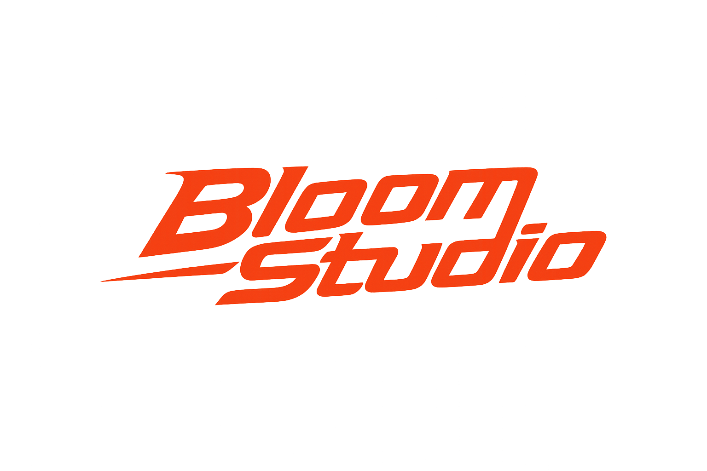

  
   
  <b>✕</b>
   
  

<h1 align="center">Bloom Studio</h1>

  <strong>Professional AI image generation — affordably.</strong>

  <a href="#features">Features</a> •
  <a href="#tech-stack">Tech Stack</a> •
  <a href="#getting-started">Getting Started</a> •
  <a href="#acknowledgements">Acknowledgements</a>

---

## Features

- 🎨 **6 AI Models** — Choose from Flux Schnell, Z-Image Turbo, GPT Image, FLUX.2 Klein, and Seedance
- ⚡ **Generous Limits** — Up to 900,000 Flux Schnell generations per month (180 high-quality images)
- 📐 **Full Dimension Control** — Create logos, banners, or any custom image size
- 💾 **Cloud History** — Access your generated images from any device
- 🔐 **Secure Auth** — Powered by Clerk with SSO support

## Tech Stack

| Layer | Technology |
|-------|------------|
| **Framework** | Next.js 16 (App Router) |
| **Language** | TypeScript (strict mode) |
| **Backend** | Convex |
| **Auth** | Clerk |
| **UI** | shadcn/ui + Tailwind CSS |
| **3D** | React Three Fiber |
| **Testing** | Vitest + React Testing Library |

## Try it now

🚀 **[Launch Bloom Studio](https://bloomstudio-mvp.vercel.app/)** — No setup required.

## Acknowledgements

Built with [Pollinations.AI](https://pollinations.ai) — open-source, free-to-use generative AI infrastructure.

---

  Made with ❤️

